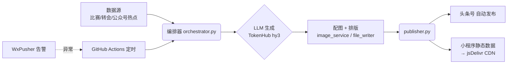
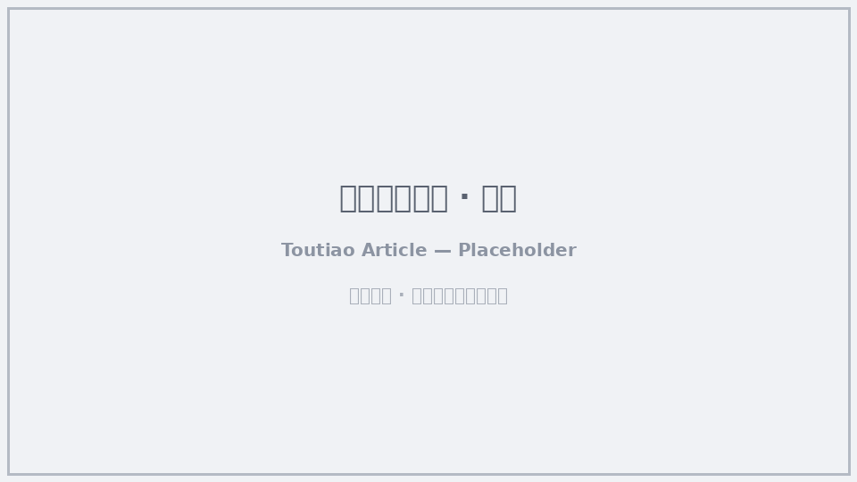
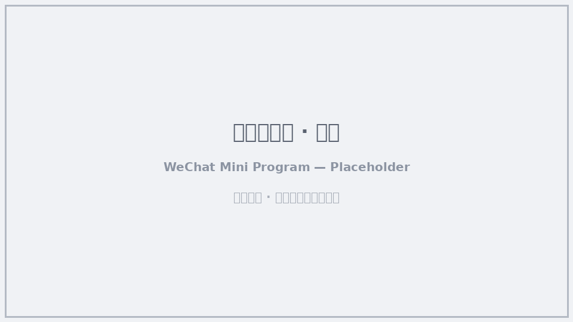

# 球评人老六 · 足球自媒体全自动内容工厂


> **一句话**：用 AI 把「选题 → 写稿 → 配图 → 发布 → 同步小程序」全包了。每天三班自动出稿，你只管看评论区吵架。

这是一个**完全无人值守**的足球自媒体内容生产系统：AI 自动追踪足球热点、生成带有固定人设「老六」的观点文章，自动发布到**今日头条（头条号）**，并同步到配套的**微信小程序**。整套流程由 GitHub Actions 定时驱动，零人工干预。

---

## 🌐 English Overview

**Lao Liu the Football Commentator** is a fully unattended, AI-driven content factory for a football (soccer) self-media brand. It automatically tracks football hotspots, generates opinionated articles in a fixed persona ("Lao Liu"), publishes them to **Toutiao (头条号)**, and syncs them to a companion **WeChat Mini Program** — all driven by GitHub Actions, zero manual work.

- 🤖 **AI writing** via a TokenHub / DeepSeek-compatible LLM (DashScope fallback), with a distinct persona per column.
- 🗓️ **Three daily batches** (Morning / Noon / Evening), 2 differentiated columns each — 6 unique pieces per day.
- 📡 **Dual-channel auto-publishing**: Toutiao (Playwright browser automation) + WeChat Mini Program (free jsDelivr CDN).
- 🛡️ **Production-grade**: idempotent re-publish guard, retry fallback, health checks & alerts (WxPusher).
- 💸 **Near-zero running cost**: free GitHub Actions + free CDN + cheap LLM.

Fork it, configure your Secrets, and you own your own football AI account. See the Chinese sections below for full details.

---

## 这是什么 / What is this

「球评人老六」是一个**足球垂类自媒体 IP 自动化引擎**。它解决的核心问题是：

> 做自媒体最贵的不是钱，是**持续产出有"人味"的内容**。一天三更、常年不断，人工写不现实，通用 AI 搬运又没灵魂、不带货。

本项目的做法是：给 AI 一个**固定人设 + 固定栏目**，让它像"一个人"一样每天稳定输出有态度、能引发站队互动的足球内容，并自动分发到多个平台。

**三个核心能力**
- 🤖 **AI 写稿**：基于 LLM（TokenHub / DeepSeek 兼容接口，通义千问兜底）生成文章，不是搬运，是"老六"的观点。
- 🗓️ **三班栏目制**：晨读 / 午间 / 晚间，每班 2 个差异化栏目，一天 6 篇不重样。
- 📡 **双端自动发布**：头条号（Playwright 浏览器自动化）+ 微信小程序（jsDelivr 免费 CDN 同步），一次生成多端触达。

---

## 为什么需要它 / Why

### 自媒体运营者的真实痛点
| 痛点 | 传统做法 | 本项目 |
|---|---|---|
| 日更三篇，写稿累死 | 雇人 / 自己硬写 | AI 全自动生成 |
| 内容没辨识度，涨粉难 | 搬运新闻，读者无感 | 固定人设「老六」，有态度有梗 |
| 多平台分发麻烦 | 手动复制粘贴 | 头条 + 小程序一次同步 |
| 断更有惩罚，请假就掉量 | 硬撑 / 花钱代运营 | 云端定时跑，节假日照样更 |
| 运维成本高 | 买服务器 | 白嫖 GitHub Actions + 免费 CDN |

### 本方案与众不同的地方
- **不是"AI 洗稿机"，是"AI 人"**：每个栏目有独立的写作人格（群聊播报体 / 烧烤摊辩论体 / 脱口秀吐槽体 / 赛后快刀体…），读者记住的是"老六"这个号，不是一堆冷冰冰的资讯。
- **栏目零重叠**：6 个栏目覆盖快讯、争议、战术、转会、辣评、球迷文化，互不抢戏，保证一天内容有节奏。
- **数据驱动选题**：结合真实比赛数据（football-data.org）、公众号热点抓取、维基/图库，避免 AI 瞎编。
- **工程级健壮性**：幂等防重发、多窗口重试兜底、健康巡检 + 告警，适合**长期无人值守**跑。

---

## 功能特性 / Features

- ✅ **每日三班自动生成**：晨读（08:00）、午间（12:00）、晚间（17:30 CST），每班 2 篇。
- ✅ **动态栏目池**：晚间从 6 个候选栏目中按当日热点智能挑 2 个，内容不僵化。
- ✅ **多数据源融合**：
  - 比赛/转会数据：football-data.org
  - 热点发现：公众号爆款探测器（`skills/gzh-explosive-content-detector`）
  - 球员配图：Wikipedia / Footyrenders
  - 通用配图：Unsplash
- ✅ **自动发布双端**：头条号（浏览器自动化登录一次后长期复用）+ 微信小程序（静态 JSON 经 jsDelivr CDN 分发）。
- ✅ **幂等保护**：`metadata.json` 记录已完成批次，重跑不会重复发稿。
- ✅ **健康监控**：`heartbeat.yml` 午检/终检 + 爬虫健康检查，异常经 WxPusher 推送告警。
- ✅ **手动/补发通道**：`daily.yml` 支持 `workflow_dispatch` 手动触发与紧急补发。
- ✅ **配套小程序**：零成本微信小程序，自动同步当日文章，读者即点即读。

---

## 它是怎么跑起来的 / How it works



每日流程（`batch.yml` 由 cron 触发）：

1. **确定批次**：根据当前 CST 时段判定 morning / noon / evening。
2. **选题**：按栏目规则 + 数据源打分，选出当日话题与角度。
3. **生成**：LLM 按栏目人设写稿（带互动投票/站队引导）。
4. **配图排版**：抓取球员图/通用图，渲染 Markdown。
5. **发布**：头条号浏览器自动化发文；同步小程序静态数据。
6. **巡检**：心跳工作流核对批次完成情况，缺失则告警。

---

## 技术栈

| 层 | 技术 |
|---|---|
| 语言 | Python 3 |
| LLM | TokenHub（tencentmaas，OpenAI 兼容）/ DeepSeek；通义千问 DashScope 兜底 |
| 数据 | football-data.org、公众号抓取、Wikipedia API、Unsplash、Footyrenders |
| 自动化 | GitHub Actions（`batch.yml` / `daily.yml` / `heartbeat.yml`） |
| 浏览器 | Playwright（头条号发布） |
| 前端 | 微信小程序 + jsDelivr CDN |
| 通知 | WxPusher |

---

## 快速开始 / 自己搭一个

> 想拥有**你自己的**足球 AI 号？Fork 本项目，配好 Secrets，剩下的交给 GitHub。

### 1. Fork & 启用 Actions
- Fork 到你的账号，**公开仓库可白嫖 GitHub Actions 额度**。
- 进入 `Settings → Actions → General`，确认 `Allow all actions` 已开启。

### 2. 配置 Secrets（`Settings → Secrets and variables → Actions`）

| Secret | 必需 | 说明 |
|---|---|---|
| `HY3_API_KEY` | ✅ | TokenHub / DeepSeek 兼容 LLM Key（**只在 Secrets 里，永不进代码**） |
| `TOUTIAO_AUTH_B64` / `TOUTIAO_AUTH_GZ` | ✅（发头条） | 头条号 Playwright 登录态（base64）。本地先 `python scripts/publisher.py --login` 登录，把 `toutiao_auth.json` 内容 base64 后存入 |
| `GH_PAT` | ✅（同步小程序） | 用于回写小程序静态数据的 Personal Access Token |
| `WXPUSHER_APPTOKEN` / `WXPUSHER_UID` | ⚠️ 推荐 | 运行告警推送 |
| `FOOTBALL_DATA_KEY` | ⚠️ | football-data.org 比赛数据（增强选题） |
| `DASHSCOPE_API_KEY` | ⚠️ | 兜底 LLM |
| `UNSPLASH_ACCESS_KEY` | ⚠️ | 通用配图 |

### 3. 本地首次登录头条号
```bash
pip install -r requirements.txt
python scripts/publisher.py --login      # 浏览器打开手动扫码登录，自动保存状态
# 将生成的 toutiao_auth.json 内容 base64 编码后填入上方 Secret
```

### 4. 让它自己跑
- 定时：GitHub Actions 按 CST 三班 cron 自动触发。
- 手动：在 Actions 页面对 `足球自媒体每日发布（手动/外部触发）` 点 `Run workflow`，可选 `batch=morning/noon/evening` 补发。

### 5.（可选）配套小程序
`miniprogram/` 是一个零成本微信小程序，构建后静态数据经 jsDelivr CDN 分发。按 `miniprogram/README.md` 注册、加 CDN 白名单、上传审核即可。

---

## 项目结构

```
football-auto-publish/
├── orchestrator.py          # 文章生成编排器（选题→生成→配图→排版）
├── publisher.py             # 头条号 Playwright 自动发布 + 小程序数据回写
├── data_collector.py        # 比赛/转会/热点数据采集
├── media_scraper.py         # 媒体素材抓取
├── image_service.py         # 配图服务
├── match_scheduler.py       # 赛程调度
├── constants.py             # 批次/栏目配置、人格与写作风格定义
├── config/config.yaml       # LLM、数据源、输出配置
├── prompts/                 # 选题/改写提示词模板
├── skills/                  # 公众号爆款探测器
├── scripts/                 # 巡检、补发、告警、静态数据导出等
├── miniprogram/             # 配套微信小程序
├── tests/                   # 单元测试
└── .github/workflows/       # batch / daily / heartbeat 三个工作流
```

---

## 调度与健康监控

- **`batch.yml`**：每日三班主发布流程，含多窗口重试兜底（GitHub cron 偶发延迟也能命中正确批次）。
- **`daily.yml`**：手动/外部触发与紧急补发。
- **`heartbeat.yml`**：午检（仅校验晨读是否完成，避免未到点误报）+ 终检（校验三班全完成），异常经 WxPusher 告警。

---

## 成本 / 费用

| 项目 | 费用 |
|---|---|
| GitHub Actions 运行 | 公开仓库免费额度内基本为 0 |
| 小程序静态托管（jsDelivr CDN） | 免费 |
| LLM 调用（TokenHub / DeepSeek） | 极低，按量计费 |
| 数据 API（football-data 等） | 免费档或按需 |
| 头条号 / 小程序 | 平台免费 |

**整体接近"零运维成本"的自媒体内容生产线。**

---

## 为什么选这个方案（写在最后）

如果你也在做或想做**足球垂类自媒体**，这个方案值得 fork 的理由：

1. **真·无人值守**：从选题到发布全链路自动化，断更焦虑归零。
2. **有 IP 才有价值**：固定人设「老六」输出观点，沉淀的是**粉丝与互动**，而不是一次性阅读——这对涨粉和后续变现才是关键。
3. **成本几乎为零**：白嫖 CI + 免费 CDN + 便宜 LLM，一个人就能养一个"日更三篇"的号。
4. **工程上能长期跑**：幂等防重、重试兜底、健康巡检、告警——这些"看不见的活"决定了一个自动化项目是跑三天还是跑三年。
5. **可演进**：栏目、人格、数据源都在 `constants.py` / `config.yaml` / `prompts/` 里集中配置，想换风格、加栏目、接新平台都很容易。

> 拿去改、拿去用、拿去养你自己的"老六"。欢迎 Issue 与 PR。

---

## 📸 截图 / Screenshots

> 下方为占位图，请用你自己的**头条号文章页**与**微信小程序界面**真实截图替换 `docs/screenshots/` 下的文件（建议 PNG，宽 ≥ 800px）。

| 渠道 | 预览 |
|---|---|
| 头条号（头条号）已发布文章页 |  |
| 配套微信小程序文章阅读页 |  |

**建议截图内容**
- `toutiao-article.png`：一篇已发布的「老六」风格文章，含标题、正文、互动投票/站队引导。
- `miniprogram.png`：小程序内文章列表或详情页。

---

## 免责声明

- 本仓库内容由 AI 自动生成，**不代表任何真实立场**，文中观点均为"老六"人设演绎，请勿对号入座。
- 请遵守各内容平台（今日头条、微信等）的运营规范与社区公约，合规使用。
- 使用本项目产生的任何内容、账号风险与费用，均由使用者自行承担。
- 与任何足球俱乐部、球员、联赛无官方关联。
